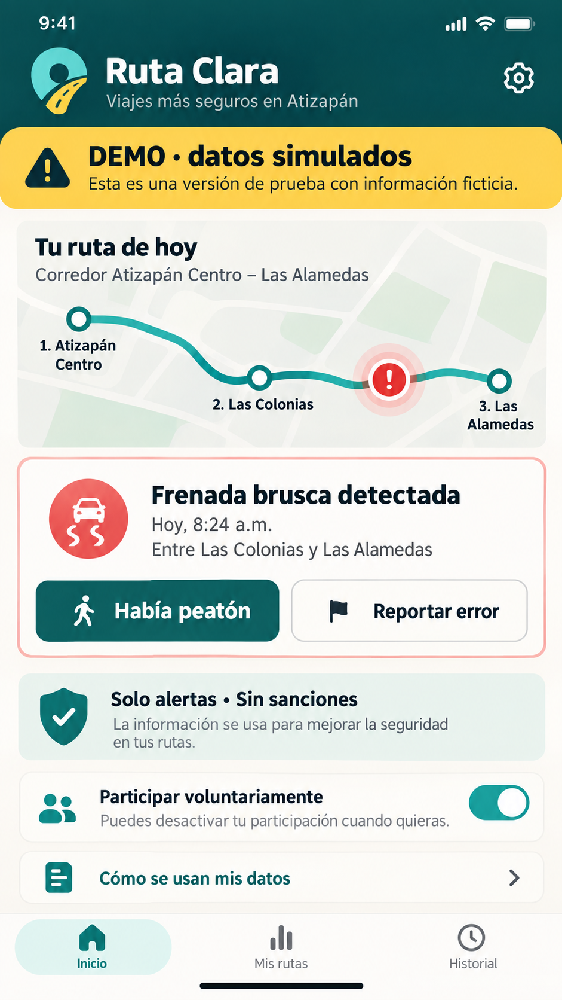
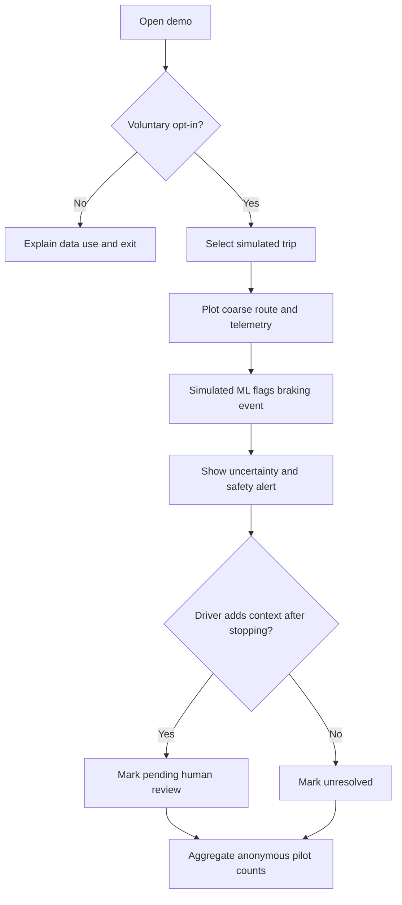
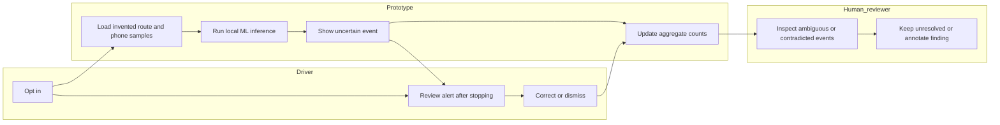

# BUSINESS BENDING · WEEK 7 — PACKET

**Isabella Zevada · Ruta Clara · draft before code · 23 September 2026**

> **Status:** The team Blueprint calls Isabella's slice a proposed declaration, pending team confirmation. The corridor and stop pair, operator, payer, data controller, case owner, independent verifier and closing authority are still unconfirmed. The interface uses fictional corridor labels and simulated vehicle events. This is a prototype, not a field pilot.

## Problem in my words

A harsh braking event in a colectivo can mean dangerous driving, but it can also mean a pedestrian entered the street or pavement was damaged. A sensor alone misses that context. I want to help the driver see a timely, understandable alert and correct a mistaken interpretation, without turning the resulting data into a punishment, a driver score or an autonomous-vehicle training set.

## Exact user

María, an invented 46-year-old colectivo driver on a proposed Atizapán commuter corridor, uses an older Android phone and sometimes loses connectivity. She has little time to type during work and worries that a false alert could cost her income. She only reviews and annotates a past event after stopping the vehicle safely.

## Success before the module closes

On the live URL, María can opt into a fictional demonstration, choose a simulated trip and see a route map with a braking event inferred from simulated phone accelerometer and GPS samples. The screen labels the model output **SIMULATED AI**, shows uncertainty and offers a large one-tap correction such as “Había peatón,” “Bache,” “Otro vehículo,” or “Fue un error.” Her correction changes that event to **context supplied / pending human review** and can be undone. She can leave the demo, view a plain-language use-of-data policy, and verify that no sanction, individual score, raw trace or personal record is created. The reviewer screen shows only aggregate counts and an unresolved denominator; it cannot sanction anyone.

This prototype demonstrates interaction and technical wiring. It does not measure crash reduction, real classifier accuracy, route parity or a completed worker agreement.

## Image-generated mockup

The image is a design reference. Place names and events shown in it are fictional demo labels, not a confirmed corridor or field data.

## Feature flow

## Actor swimlane

The human-review step is a visible mock workflow, not a claim that an operator or authority has approved anything. No automatic dispatch, subsidy, sanction or case closure.

## Benchmark

**Strongest relevant existing solution:** Mobileye 8 retrofits vehicles with AI-assisted collision warnings and fleet analytics: https://ims.mobileye.com/fleets/us/products/mobileye-8-connect/ . **My localized slice:** an inexpensive phone-based, fictional colectivo demonstration makes event context correctable by the driver, keeps uncertainty visible, and forbids punitive scores and reuse for autonomous training without fresh approval, compensation and an income-protecting transition. Mobileye also describes mapping alert hot spots and future autonomous mapping, which makes the data-use boundary especially relevant: https://ims.mobileye.com/fleets/us/fleet-solutions/local-authority-fleet-management/ .

## Three-year view

If the slice works in a consented field pilot, Ruta Clara could become an independently governed safety layer for older colectivos, offering useful warnings and verified infrastructure reports across corridors. Participating drivers would control and be paid for any contributed knowledge, with documented correction, deletion and appeal paths; route-level public metrics would show unresolved cases alongside improvements. Any separate autonomous research would require new worker approval, compensation and an income-protecting transition before it could reuse this knowledge.

## Scope cut

- No ride-hailing, bookings, payments, passenger profiles or live vehicle dispatch.
- No real driving alerts, crash prediction claim, live camera, face or audio capture, vehicle plates, continuous tracking, driver ranking or automatic sanctions.
- No stored personal data, accounts or Supabase tables in the public demonstration. If later adding persistence of personal data, add Google sign-in and owner-only Row Level Security before collecting it.
- No claim that the team has confirmed the actual corridor, participating operator, payer, controller, case owner, independent verifier or signing authority.
- No autonomous training. The separate autonomous pilot position remains a recorded team dissent.

## Architecture and free stack

| Layer | Choice | Why / boundary |
| --- | --- | --- |
| Interface | Static responsive web app, hosted on a free tier | Large Spanish controls; works on an older phone; no account or personal records |
| Geodata and map | Leaflet with OpenStreetMap tiles, demo route geometry invented and conspicuously labeled | Show coarse segments and event location; map tiles need connectivity; provide simple offline fallback route schematic |
| ML | TensorFlow.js small local classifier or deterministic pretrained demonstration model over invented acceleration windows | Real local inference must execute; display “SIMULATED AI” and confidence as illustrative, never safety certification |
| Third Dragon component | Simulated phone accelerometer telemetry and GPS samples | Explicit sample labels; no device permission or live data collection |
| State | In-memory only, reset on reload | Prevent collection of driver identifiers or histories; corrections only affect the current demo |
| Review | Aggregate demo queue with unresolved and false-positive counts | No punitive action; human review remains a mock status |
| Delivery | GitHub repository and two separate free hosting deployments | Evidence of first deployment, bug discovery, fix and redeployment |

**Security floor before build:** no secrets or keys in repo; no personal data stored; no Supabase tables in this slice; validate and cap every user input (prefer fixed choices); invented seed data labeled on every screen. If persistence is introduced, implement Google authentication and owner-only RLS first. Do not infer that a public demo is suitable for real-time driving.

## Test plan and evidence

1. Verify opt-out reveals policy and does not start a trip; opt-in starts the demo; refresh clears in-memory state.
2. Verify a real local inference function runs on labeled simulated samples and its result is presented as simulated, uncertain and non-punitive.
3. Verify route map and offline fallback both retain the simulated label and coarse location; no raw driver trace or identifier is exported.
4. Verify each correction option updates the event and aggregate counts; undo reverses it; conflicting evidence remains pending review, never automatically closed.
5. Verify mobile-width text, keyboard focus and large tap targets. No controls invite use while driving.
6. Inspect network requests and built assets for secrets, personal information and prohibited telemetry; test input bounds.
7. First deployment: execute checks, document at least one actual bug with reproduction and screenshot, fix and test it, then redeploy. Record both deployment timestamps/URLs and commits; do not invent a bug.
8. Fresh-chat persona test: show screenshots in order to an invented driver persona; log every hesitation verbatim and fix the most serious one. This has not yet been done.
9. Before a real pilot, confirm the Blueprint's route, stop pair, operator, payer, controller, independent verifier, case owner and signing authority; collect a two-week baseline and compare by route/time, including waits, crowding, breakdowns, hazards, response, unresolved, false positives, driver burden and cost.

## Implementation prompt for coding agent

Build the packet's one-feature Ruta Clara prototype as a static Spanish mobile-first web app. Start with a commit containing this packet and the generated mockup; do not code before it. Implement in small commits: (1) scaffold and accessibility shell, (2) invented route and Leaflet map with offline schematic fallback, (3) actual local ML inference over labeled simulated accelerometer samples plus uncertainty display, (4) consent, correction and undo with in-memory state, (5) aggregate mock review and security/copy checks, (6) documented bug fix and redeployment. Set no API keys and store no personal data. Require visible “DEMO · datos simulados” and “IA simulada” on every relevant screen, no driver score, no sanctions, no autonomous data reuse. Acceptance: a driver can consent, inspect a simulated event on a map, supply or undo context after stopping, and see it become pending human review; no path automatically closes or penalizes an event. Use five or more meaningful commits, two actual deployments, and a DECISIONS.md Session Close with next first move, commit and push. Capture actual test results and URLs; never claim a persona test, deployment or bug fix that did not occur.

## Decisions and next move

Decision: choose the driver-facing correction of one simulated braking event, with only anonymous aggregate review. Next move: confirm the team's declaration and concrete pilot governance details, then create the repository and commit this packet before writing application code.
